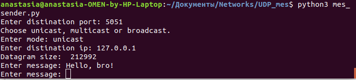
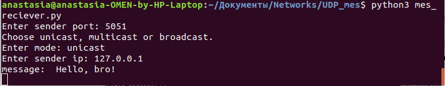
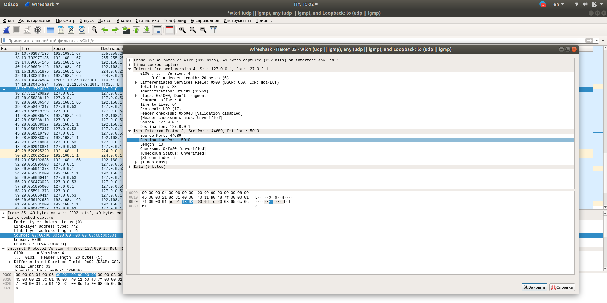
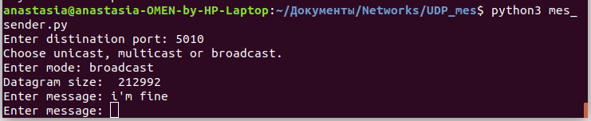
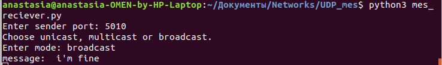
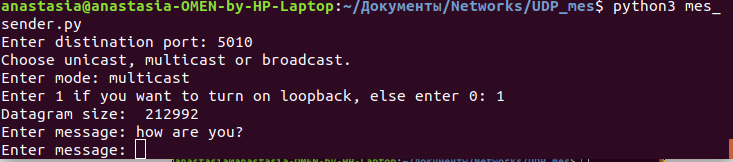
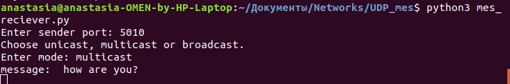
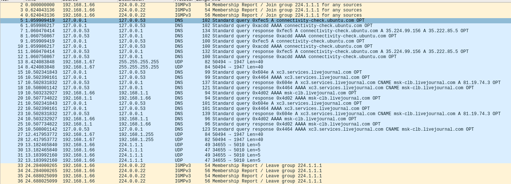

# Простейший UPD - мессенджер.
## Выполнила студентка группы Б17-505 Худоярова Анастасия

# Задание 3б
В данном задании был разработан простейший udp мессенджер, поддерживающий работу режимах unicast, broadcast, multicast. </br>
Обмен пакетами происходит запуском двух скриптов и установкой надлежащих параметров. Ниже представлены примеры работы для всех трех режимов. </br>

#  **unicast**</br>
</br>
</br>
**Пример общения:**<br/>
</br>
# **broadcast**</br>
</br>
 </br>
**Пример общения:**<br/>
 </br>
Максимальный размер дейтаграммы, которую можно отправить: <br/> ***212992***

Получено командой:
```
print("Datagram size: ", sock.getsockopt(socket.SOL_SOCKET, socket.SO_SNDBUF))
```
# Задание 4а
В данном задании выполнена пересылка multicast-сообщений.</br>
# **multicast**</br>
</br>
</br>
**Пример общения:**<br/>
</br>

Включение - выключение multicast - трафика на себя командой: 
```
sock.setsockopt(socket.IPPROTO_IP, socket.IP_MULTICAST_LOOP, 1)
sock.setsockopt(socket.IPPROTO_IP, socket.IP_MULTICAST_LOOP, 0)
```
Изменение TTL производится путем изменения константы, затем TTL учитывается при инициализации опции мультикаста и добавлении в группу.
```
req = struct.pack("4sl", socket.inet_aton(UDP_IP_SENDER), socket.INADDR_ANY)
sock.setsockopt(socket.IPPROTO_IP, socket.IP_ADD_MEMBERSHIP, req)
```


